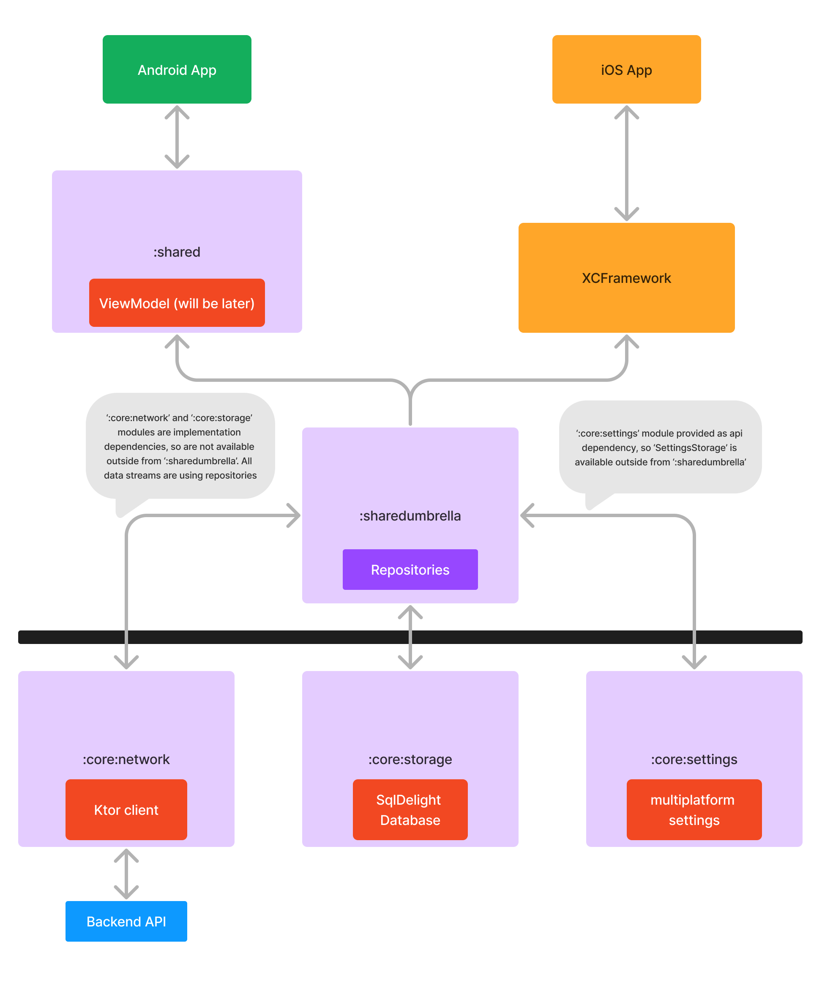

# ✨KmpProjectSample✨

(project is in progress now) 🛠️

## KMP sample project with **Network** and **Storage** sharing between Android and iOS.

## Stack:
- [Kotlin Multiplatform](https://kotlinlang.org/docs/multiplatform.html) - multiplatform technology
- [Ktor](https://ktor.io/) - for network
- [Multiplatform-Settings](https://github.com/russhwolf/multiplatform-settings) - to store key-value settings
- [SqlDelight](https://github.com/cashapp/sqldelight) - for database
- [JsonPlaceholder](https://jsonplaceholder.typicode.com) - as backend api

## Structure:
- `androidApp`, `iosApp`: default KMP-project Android and iOS apps
- `core:network`: core module for network calls
- `core:storage`: core module with database
- `core:settings`: core module for store key-value settings (like SharedPreferences/UserDefaults)
- `core:memorycache`: core module for store key-value data in app-single MemoryCache (in RAM)
- `sharedumbrella`: KMP module that connects `core:*` modules with `shared` module (for Android) and XCFramework (for iOS) ([Umbrella](https://www.jetbrains.com/help/kotlin-multiplatform-dev/multiplatform-project-configuration.html#several-shared-modules))
- `shared`: default KMP module that provides `sharedumbrella` and `other future modules and logic` to Android app (iOS native app uses only `sharedumbrella` module as XCFramework)

## Build Android App:
Just run "androidApp" configuration as usual in Android Studio (or other IDE) 😇

## Build iOS App:
- Open any Terminal (or Android Studio/other IDE). You will need "./gradlew" command possibility
- Set execution flag for "gradlew" by terminal command: **chmod +x gradlew**
- Build XCFramework for module "sharedumbrella" by terminal command: **./gradlew :sharedumbrella:assembleXCFramework**
- Open Xcode project iosApp (or any your iOS native project)
- Add (by drag-n-drop) built framework (sharedumbrella/build/XCFrameworks/.../**sharedumbrella.xcframework**) to Xcode project iosApp -> General -> **Frameworks, Libraries, and Embedded Content**
- You are amazing! Just "import sharedumbrella" anywhere and enjoy! 😇

(note that this steps are creates external-path dependency (built XCFramework is outside of iosApp folder). You can copy generated XCFramework to iOS project folder if you want)

## Project structure:
